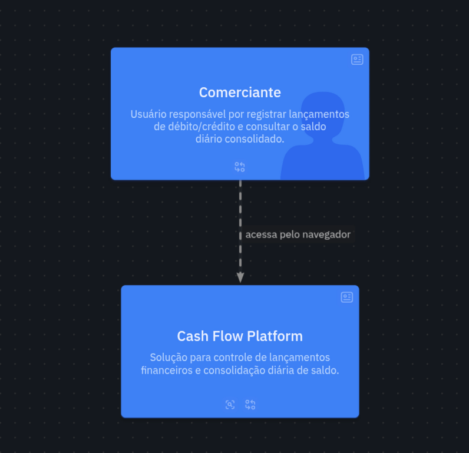
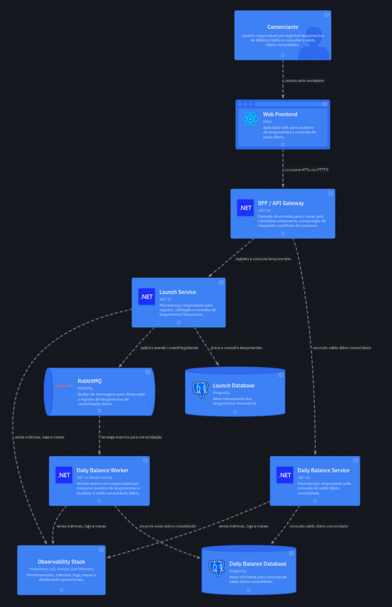
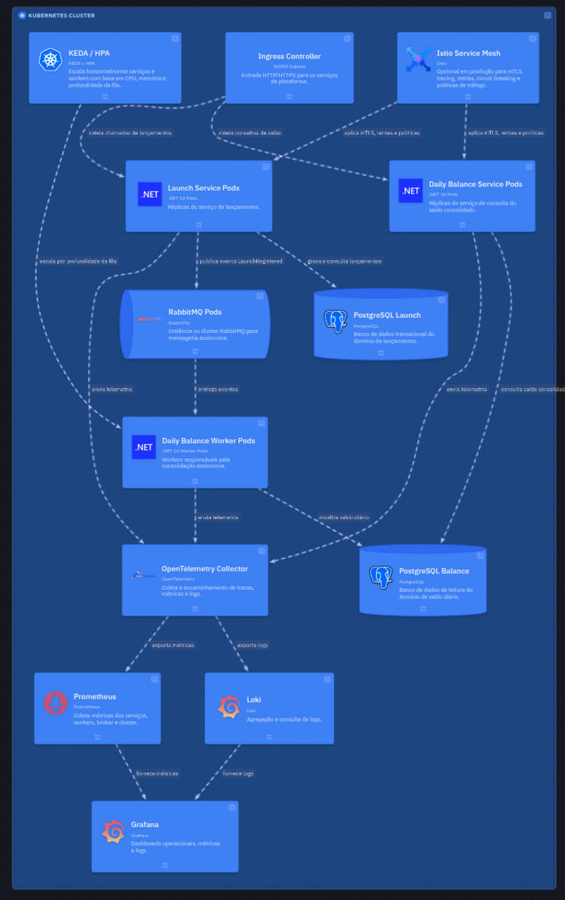

# Verx — Desafio Arquiteto de Soluções: Cash Flow Platform

Solução para controle de fluxo de caixa diário com registro de lançamentos (débitos e créditos) e consolidação de saldo diário.

> **Para o avaliador:** este README resume o que roda de fato no MVP local. Os diagramas C4 (principalmente *Deployment — Kubernetes*) representam a **arquitetura-alvo**; a seção [Escopo: implementado vs documentado](#escopo-implementado-vs-documentado) explicita o que ficou fora do código por limitação de tempo do teste. Enunciado: [Documentos/teste.md](Documentos/teste.md).

---

## Checklist do Enunciado

> Mapeado diretamente a partir de [Documentos/teste.md](Documentos/teste.md).

### Requisitos Obrigatórios

| # | Requisito | Status | Onde encontrar |
|---|---|---|---|
| 1 | Mapeamento de domínios funcionais e capacidades de negócio | ✅ Implementado | `Documentos/02-dominios-capacidades.md` |
| 2 | Refinamento de requisitos funcionais e não-funcionais | ✅ Implementado | `Documentos/01-requisitos.md` |
| 3 | Desenho da solução completo (Arquitetura Alvo) | ✅ Implementado | Diagramas C4 em `diagramas/c4/` — contexto, container, componente, deployment K8s |
| 4 | Justificativa na escolha de ferramentas/tecnologias e tipo de arquitetura | ✅ Implementado | `Documentos/03-decisoes-arquiteturais.md` (9 ADRs) |
| 5 | Serviço de controle de lançamentos | ✅ Implementado | `src/LaunchService/` — API REST + EF Core + RabbitMQ |
| 6 | Serviço de consolidado diário | ✅ Implementado | `src/DailyBalanceService/` + `src/DailyBalanceWorker/` |
| 7 | Testes | ✅ Implementado | xUnit + Testcontainers (100% cobertura), E2E Playwright, carga k6 |
| 8 | README com instruções claras de como rodar localmente | ✅ Implementado | Este documento — seção [Como rodar](#como-rodar-localmente) |
| 9 | Repositório público com toda a documentação | ✅ Implementado | `Documentos/`, `diagramas/`, `infra/`, `src/` |

### Requisitos Não-Funcionais

| # | Requisito | Status | Evidência |
|---|---|---|---|
| 1 | Launch Service não cai se o serviço de consolidado cair | ✅ Implementado | Desacoplamento via RabbitMQ — Launch não depende do Balance Service |
| 2 | Consolidado suporta **50 req/s** com no máximo **5% de perda** | ✅ Implementado | Cache `IMemoryCache` (5 min) + teste k6 50 req/s (`scripts/load/`); resultados em `/tests` → *Carga* |

### Requisitos Diferenciais

| # | Diferencial | Status | Onde encontrar |
|---|---|---|---|
| 1 | Arquitetura de Transição (migração de legado) | 📄 Documentado | `Documentos/07-evolucoes-futuras.md` — Seção 1 (Strangler Fig Pattern) |
| 2 | Estimativa de custos com infraestrutura e licenças | 📄 Documentado | `Documentos/06-estimativa-custos.md` |
| 3 | Monitoramento e Observabilidade | ✅ Implementado | OTel SDK (métricas + logs + **traces**) → Collector → Prometheus + Loki + **Tempo** → Grafana |
| 4 | Critérios de segurança para consumo/integração de serviços | ✅ Parcial | `Documentos/04-seguranca.md` + JWT, RBAC, rate limiting, security headers no BFF |

> **Legenda:** ✅ Código rodando no Compose · 📄 Documentado / arquitetura-alvo

---

## Funcionalidades implementadas (MVP executável)

| Área | O que funciona |
|---|---|
| **Negócio** | Registro de lançamentos (crédito/débito), consulta por data/período, saldo diário consolidado (assíncrono via evento) |
| **Frontend** | SPA React — login, lançamentos, saldo, gestão de usuários (admin), relatórios de testes (`/tests`) |
| **BFF** | Ponto único do canal web: login JWT, RBAC (`admin`/`merchant`), rate limiting, headers de segurança, proxy para Launch e Balance |
| **Microserviços** | Launch Service (escrita), Daily Balance Service (leitura + cache), Daily Balance Worker (consolidação RabbitMQ) |
| **Dados** | PostgreSQL com banco por domínio (`launch_db`, `daily_balance_db`, `bff_db`); schema do consolidado owned pelo Worker |
| **Mensageria** | RabbitMQ + MassTransit — evento `LaunchRegistered`, retry na fila do worker |
| **Resiliência (NFR)** | Launch continua se Balance cair; lag eventual entre lançamento e saldo documentado e observável |
| **Performance (NFR)** | Cache `IMemoryCache` (5 min) no Balance; teste k6 **50 req/s** por 30s com meta ≤ 5% erro (`scripts/run-quality-gates.sh`) |
| **Testes** | xUnit + Testcontainers (Postgres/WireMock), cobertura **100% linha/branch** backend, E2E Playwright, carga k6 — painel em `/tests` |
| **Observabilidade** | OpenTelemetry SDK (métricas + logs + **traces** OTLP) → Collector → Prometheus + Loki + **Tempo** → Grafana |
| **Infra local** | `docker compose` sobe stack completa; build via `./build.sh` |

**Fluxo real:** `Browser → Frontend → BFF → Launch / Balance` (microserviços **não** são expostos ao browser).

---

## Escopo: implementado vs documentado

O desafio pede arquitetura-alvo, ADRs e diagramas **além** do código mínimo ([teste.md](Documentos/teste.md), linhas 74–78). Separamos o que está **rodando no Compose** do que está **só na documentação/diagramas** (evolução produção).

| Tema | Arquitetura-alvo (diagramas / `Documentos/`) | MVP local (este repositório) |
|---|---|---|
| **Runtime** | Kubernetes, Ingress, múltiplas réplicas | Docker Compose, 1 container/serviço |
| **Escalabilidade** | HPA (Balance/Launch), KEDA (Worker) | Artefatos YAML em `infra/k8s/` — **não aplicados**; aba *Escalabilidade* em `/tests` explica |
| **Observabilidade** | SLI/SLO, alertas Prometheus | Métricas + logs + **traces** (OTel → Tempo) + dashboard Grafana; **sem** alertas configurados |
| **Segurança** | mTLS entre serviços, secrets no Vault, WAF | JWT + RBAC + rate limit + security headers no BFF; secrets em env vars do Compose |
| **Entrega de eventos** | Outbox Pattern (MassTransit) | Publish direto pós-`SaveChanges` — **risco documentado** em [07-evolucoes-futuras.md](Documentos/07-evolucoes-futuras.md) |
| **Transição / custos** | Arquitetura de transição, estimativa AWS/GCP | Documentados em `Documentos/` — sem automação de deploy cloud |
| **Canais** | BFF Web + Mobile (futuro) | Apenas canal web |

---

## Aderência ao enunciado do teste

| Requisito ([teste.md](Documentos/teste.md)) | Entrega |
|---|---|
| Domínios, capacidades, RF/RNF refinados | `Documentos/01-requisitos.md`, `02-dominios-capacidades.md` |
| Arquitetura-alvo + justificativas (ADR) | Diagramas C4 + `Documentos/03-decisoes-arquiteturais.md` |
| Serviço de lançamentos + consolidado diário | Launch Service + Worker + Balance Service |
| Código + testes + README + repo | Este repositório, `./build.sh`, suite em `/tests` |
| RNF: Launch up se Balance cair | Desacoplamento + fila; Launch não depende do Balance |
| RNF: 50 req/s, ≤ 5% perda no consolidado | k6 + cache; resultados em `/tests` → aba *Carga* |
| Diferencial: observabilidade | Stack Prometheus/Loki/Grafana + OTel (ver URLs abaixo) |
| Diferencial: segurança integração | `Documentos/04-seguranca.md` + controles parciais no BFF |
| Evoluções futuras explícitas | `Documentos/07-evolucoes-futuras.md` |

---

## Retorno ao feedback da avaliação anterior

Itens apontados na revisão inicial e situação **atual** deste repositório:

| Feedback | Situação atual |
|---|---|
| BFF ausente; frontend ligava direto nos microserviços | **Corrigido** — BFF implementado; frontend usa apenas `/api/*` do BFF |
| Observabilidade só documentada | **Corrigido** — OTel SDK (métricas + logs + traces), Collector, Prometheus, Loki, Tempo, Grafana; métricas de negócio instrumentadas |
| 50 req/s sem validação prática | **Corrigido** — k6 50 req/s (`tests/load/`), cache no Balance, painel `/tests` |
| HPA/KEDA/escala só documental | **Parcial** — YAMLs de referência + doc; autoscaling **não** ativo no Compose |
| Segurança (mTLS, Vault, rate limit, headers) | **Parcial** — JWT, RBAC, rate limit e security headers **no BFF**; mTLS/Vault **não** implementados |
| Cobertura de testes insuficiente | **Corrigido** — integração Testcontainers, testes de aplicação, E2E, 100% cobertura backend |
| Outbox Pattern ausente | **Pendente (consciente)** — reconhecido como risco; roadmap em `07-evolucoes-futuras.md` |
| Conflitos de versão NuGet (EF 10.0.4 vs 10.0.9) | **Corrigido** — projetos de teste alinhados à versão dos serviços |

---

## Pré-requisitos

- [Docker](https://docs.docker.com/get-docker/) + Docker Compose
- [.NET 10 SDK](https://dotnet.microsoft.com/download/dotnet/10.0)
- [Node.js 20+](https://nodejs.org/) (para build do frontend)

---

## Como Rodar Localmente

> **Importante:** use sempre o `./build.sh`, não o `docker compose up` diretamente.
> Os Dockerfiles copiam o output de `dotnet publish` gerado localmente — sem rodar o script, as imagens falham no build por não encontrar o diretório `publish/`.

```bash
git clone <repo-url>
cd verx-fluxo-caixa-desafio-arq-sol
chmod +x build.sh
./build.sh
```

O script:
1. Executa `dotnet publish` para cada serviço (BFF, Launch, Daily Balance, Worker — output em `build-output/`)
2. Executa testes backend com cobertura (Coverlet) e gera `frontend/public/test-metrics.json` com contagens reais
3. Gera relatórios HTML em `frontend/public/coverage/` (BFF, Launch, Balance, Worker)
4. Executa `npm install && npm run build` no frontend
5. Executa `docker compose up --build` (os containers copiam os artefatos já gerados)

Após a stack subir, execute os **quality gates** (E2E + carga 50 req/s):

```bash
chmod +x scripts/run-quality-gates.sh
./scripts/run-quality-gates.sh
```

Os resultados aparecem no menu **Testes & Cobertura** (`/tests`).

> **Primeira execução:** o Docker pode precisar baixar as imagens base (`postgres`, `rabbitmq`, `nginx`, `dotnet/aspnet`). Se houver erro de DNS no pull de imagens, baixe-as manualmente com `docker pull nginx:alpine` antes de rodar o script.

Aguarde todos os containers ficarem `healthy`/`Up`. Em seguida acesse:

| Serviço | URL | Descrição |
|---|---|---|
| **Frontend** | http://localhost:3000 | Interface web |
| **BFF (Web Channel)** | http://localhost:5000/swagger | Autenticação, RBAC, rate limiting e proxy |
| **Launch / Balance** | rede interna Docker | Sem login próprio — JWT emitido pelo BFF |
| **RabbitMQ Management** | http://localhost:15672 | user: `guest` / pass: `guest` |
| **Grafana** | http://localhost:3001 | user: `admin` / pass: `cashflow123` — dashboard *CashFlow — Overview* |
| **OpenTelemetry Collector** | http://localhost:4318 (HTTP) / `:4317` (gRPC) | recebe OTLP dos serviços .NET |
| **Prometheus** | http://localhost:9090 | scrape métricas do collector (`:8889`) |
| **Loki** | http://localhost:3100 | logs via collector OTLP → Loki |

---

## Acesso ao PostgreSQL (pgAdmin / DBeaver)

O Postgres fica exposto na porta **5432** do host. Use estas credenciais:

### Conexão principal (superusuário — pgAdmin)

| Campo | Valor |
|---|---|
| **Host** | `localhost` |
| **Porta** | `5432` |
| **Usuário** | `postgres` |
| **Senha** | `postgres123` |

### Usuário da aplicação (usado pelos serviços .NET)

| Campo | Valor |
|---|---|
| **Usuário** | `cashflow` |
| **Senha** | `cashflow123` |

### Bancos disponíveis

| Banco | Serviço | Tabelas principais |
|---|---|---|
| `bff_db` | BFF | `Users` (login e gerenciamento de usuários) |
| `launch_db` | Launch Service | `Launches` |
| `daily_balance_db` | Daily Balance Worker/Service | `DailyBalances` |

**No pgAdmin:** clique com o botão direito em *Servers → Register → Server*, aba *Connection*, preencha host/porta/usuário/senha acima e salve. Os três bancos aparecem em *Databases*.

> Se o login falhar com "e-mail ou senha inválidos", verifique se o container `cashflow-bff` está **Up** (não em *Restarting*). Causa comum: banco `bff_db` ausente em volume antigo — veja seção abaixo.

---

## Autenticação e Usuários

O login é validado no **BFF** contra o banco `bff_db`. As senhas são armazenadas com hash **PBKDF2 + SHA256** (salt aleatório por usuário).

### Credenciais padrão

Na **primeira subida**, o BFF executa migrations e cria automaticamente o usuário administrador:

| Campo | Valor |
|---|---|
| **E-mail (login)** | `admin@admin.com` |
| **Senha** | `Master@123` |

> Use o **e-mail** como login — não há campo separado de usuário.

### Gerenciamento de usuários

Pelo frontend: menu **Usuários** (`/users`) — criar, editar nome/e-mail e alterar senha.

Pela API (BFF, requer role **admin**):

| Método | Endpoint | Descrição |
|---|---|---|
| `POST` | `/api/auth/login` | Login (e-mail + senha) — rate limit 10/min por IP |
| `GET` | `/api/users` | Listar usuários |
| `POST` | `/api/users` | Criar usuário (role `merchant`) |
| `PUT` | `/api/users/{id}` | Editar nome e e-mail |
| `PUT` | `/api/users/{id}/password` | Alterar senha |

### RBAC

| Role | Acesso |
|---|---|
| `admin` | Lançamentos, saldo e gerenciamento de usuários |
| `merchant` | Lançamentos e saldo |

### Segurança no BFF (implementado)

- **Rate limiting:** 10 req/min no login, 100 req/min nos demais endpoints
- **Security headers:** `X-Content-Type-Options`, `X-Frame-Options`, `CSP`, `Referrer-Policy`
- **Microserviços:** sem endpoint de login — validam apenas JWT repassado pelo BFF

### Gestão de secrets

**MVP (local / docker-compose):** credenciais em variáveis de ambiente no `docker-compose.yml` e defaults em `appsettings.json` — valores fixos para facilitar execução do desafio. **Não usar esses valores em produção.**

| Secret | Uso |
|---|---|
| `Jwt:Secret` | Assinatura do JWT (BFF + microserviços) |
| `ConnectionStrings__Default` | Postgres por serviço |
| `RabbitMQ__Username` / `Password` | Broker de mensagens |

Os serviços leem via `IConfiguration` (.NET). Não há integração com Vault no código do MVP.

**Produção (evolução):** secrets externalizados — staging em **Kubernetes Secrets**; produção em **HashiCorp Vault** (ou AWS Secrets Manager / Azure Key Vault), injetados no pod via sidecar ou CSI Driver. O código continua lendo `Configuration`; só muda a origem dos valores.

Detalhes: [`Documentos/04-seguranca.md`](Documentos/04-seguranca.md#gestão-de-secrets).

### Segurança em produção (evolução — ver `Documentos/07-evolucoes-futuras.md`)

| Item | Onde |
|---|---|
| **mTLS** entre serviços | Istio no Kubernetes |
| **Secrets** | Kubernetes Secrets / HashiCorp Vault |

---

### Banco `bff_db` em volumes existentes

O `init.sql` cria o `bff_db` apenas na **primeira** inicialização do Postgres. Em volumes já existentes, o serviço `db-init` no `docker-compose.yml` cria o banco automaticamente antes do BFF subir.

Se ainda assim o BFF falhar, execute manualmente:

```bash
chmod +x infra/postgres/ensure-bff-db.sh
./infra/postgres/ensure-bff-db.sh
docker restart cashflow-bff
```

Ou recrie os volumes: `docker compose down -v` e suba novamente com `./build.sh`.

---

## Fluxo de Teste (passo a passo)

### Via Interface Web (recomendado)

1. Acesse http://localhost:3000
2. Faça login com `admin@admin.com` / `Master@123`
3. Use o menu lateral: **Lançamentos**, **Saldo Diário** e **Usuários**

### Via Swagger (BFF)

No Swagger do **BFF** (`http://localhost:5000/swagger`):

1. `POST /api/auth/login`
```json
{ "email": "admin@admin.com", "password": "Master@123" }
```
2. Copie o `accessToken` retornado
3. Clique em **Authorize** (canto superior direito) e cole o token

> O frontend consome exclusivamente o BFF (`VITE_API_URL=http://localhost:5000`). Os microserviços permanecem acessíveis via Swagger para inspeção direta.

### 2. Registrar lançamentos

- `POST /api/launches`
```json
{ "date": "2026-06-17", "amount": 1000.00, "type": "credit", "description": "Venda do dia" }
```
```json
{ "date": "2026-06-17", "amount": 300.00, "type": "debit", "description": "Pagamento fornecedor" }
```

### 3. Consultar saldo consolidado

- `GET /api/balance/2026-06-17`

Resultado esperado:
```json
{
  "date": "2026-06-17",
  "totalCredits": 1000.00,
  "totalDebits": 300.00,
  "consolidatedBalance": 700.00
}
```

> O saldo é consolidado **assincronamente** via RabbitMQ pelo `daily-balance-worker`. Aguarde 2–5 segundos após registrar o lançamento antes de consultar.

---

## Rodar os Testes

### Backend (unitários + integração — Testcontainers)

```bash
dotnet test --settings coverlet.runsettings
```

Gera cobertura Cobertura e, via `./build.sh`, o arquivo `frontend/public/test-metrics.json` consumido pela UI.

| Projeto | Escopo |
|---|---|
| `CashFlow.Bff.Api.Tests` | Auth, usuários, proxy, middlewares |
| `CashFlow.LaunchService.Tests` | Domínio, API, Postgres |
| `CashFlow.DailyBalanceService.Tests` | Query, API, Postgres |
| `CashFlow.DailyBalanceWorker.Tests` | Consumer, Postgres |

Cobertura **100% linha/branch** por serviço (exclui `Program.cs` e migrations).

### E2E (Playwright — frontend + BFF)

Requer stack rodando (`./build.sh -d` ou containers Up):

```bash
cd frontend && npm install && npx playwright install chromium
./scripts/run-quality-gates.sh   # inclui E2E + carga
```

Cenários: login, registro de lançamento, consulta de saldo, usuários admin, página de testes.

### Teste de carga — NFR 50 req/s (k6)

Validação prática do requisito não funcional (Documentos/01-requisitos.md):

- **Endpoint:** `GET /api/balance/{date}` via BFF
- **Carga:** 50 req/s constantes por 30s
- **Critérios:** taxa de erro ≤ 5%; throughput ≥ 47,5 req/s (95% da meta)

Script: `tests/load/balance-consolidated.js` — executado por `scripts/run-quality-gates.sh`.

**Cache implementado (MVP):** `IMemoryCache` com TTL 5 min no `DailyBalanceQueryService` para leituras do consolidado.

**Escalabilidade (produção — artefatos YAML, não deployados no MVP Compose):**

| Componente | Mecanismo | Arquivo |
|---|---|---|
| Daily Balance Service | HPA (CPU/memória) | `infra/k8s/daily-balance-service-hpa.yaml` |
| Daily Balance Worker | KEDA (fila RabbitMQ) | `infra/k8s/daily-balance-worker-keda.yaml` |

No ambiente local cada serviço roda com **1 réplica fixa**; o teste k6 valida throughput/latência, não escala automática.

Resultados de E2E e carga: `frontend/public/e2e-results.json` e `load-results.json` — exibidos na aba **Testes & Cobertura**.

---

## Parar o Ambiente

```bash
docker compose down
```

Para remover também os volumes (banco de dados):
```bash
docker compose down -v
```

---

## Estrutura do Repositório

```
.
├── build.sh                          # Script de build + compose (use este para subir)
├── docker-compose.yml
├── CashFlow.slnx                     # Solution .NET 10
├── frontend/
│   ├── src/
│   │   ├── contexts/                 # AuthContext (JWT)
│   │   ├── pages/                    # LoginPage, DashboardPage, LaunchesPage, BalancePage, UsersPage
│   │   ├── components/layout/        # AppLayout (sidebar + header)
│   │   ├── services/                 # api.ts, auth.ts, launches.ts, balance.ts, users.ts
│   │   └── types/                    # Tipos TypeScript compartilhados
│   ├── Dockerfile                    # Nginx servindo o build estático
│   └── nginx.conf
├── infra/
│   └── postgres/
│       ├── init.sql                  # Cria launch_db, daily_balance_db e bff_db
│       └── ensure-bff-db.sh          # Script para criar bff_db em volumes já existentes
├── src/
│   ├── LaunchService/
│   │   ├── CashFlow.LaunchService.Api/
│   │   │   ├── Controllers/          # AuthController, LaunchesController
│   │   │   ├── Domain/               # Launch (aggregate), LaunchType, LaunchRegisteredEvent
│   │   │   ├── Data/                 # LaunchDbContext + Migrations EF Core
│   │   │   ├── Services/             # LaunchAppService, TokenService
│   │   │   ├── Middleware/           # GlobalExceptionMiddleware
│   │   │   └── DTOs/
│   │   └── CashFlow.LaunchService.Tests/
│   ├── DailyBalanceService/
│   │   ├── CashFlow.DailyBalanceService.Api/
│   │   │   ├── Controllers/          # AuthController, DailyBalanceController
│   │   │   ├── Domain/               # DailyBalance
│   │   │   ├── Data/                 # BalanceDbContext (schema gerenciado pelo Worker)
│   │   │   ├── Services/             # DailyBalanceQueryService, TokenService
│   │   │   └── Middleware/           # GlobalExceptionMiddleware
│   │   └── CashFlow.DailyBalanceService.Tests/
│   ├── DailyBalanceWorker/
│   │   ├── CashFlow.DailyBalanceWorker/
│   │   │   ├── Consumers/            # LaunchRegisteredConsumer (MassTransit 8.x)
│   │   │   ├── Domain/               # DailyBalance, LaunchRegisteredEvent
│   │   │   └── Data/                 # WorkerDbContext (dono do schema daily_balance_db)
│   │   └── CashFlow.DailyBalanceWorker.Tests/
│   └── Bff/
│       └── CashFlow.Bff.Api/
│           ├── Controllers/          # AuthController, UsersController, LaunchesController, DailyBalanceController
│           ├── Data/                 # BffDbContext + Migrations + UserSeeder
│           ├── Domain/               # User
│           ├── Services/             # AuthService, UserAppService, PasswordHasher, DownstreamProxy
│           └── Middleware/           # GlobalExceptionMiddleware
└── diagramas/
    └── c4/
        ├── model.c4                  # Diagrama C4 (Context, Container, Deployment)
        └── spec.c4
```

---

## Arquitetura

```
[Comerciante]
    |
    v (HTTPS)
[Frontend :3000]
    |
    v (JWT via BFF)
[BFF :5000] ──proxy──> [Launch Service :5001]  ---> [PostgreSQL launch_db]
    |  |
    |  └──> [PostgreSQL bff_db]  (usuários + auth)
    |                          |
    |                          | evento LaunchRegistered (RabbitMQ)
    |                          v
    |                     [RabbitMQ]
    |                          |
    |                          v (consumer assíncrono — retry 5s/15s/30s)
    |                   [Daily Balance Worker]  ---> [PostgreSQL daily_balance_db]
    |                                                    ^
    └──proxy──> [Daily Balance Service :5002] ──────────┘ (somente leitura)
```

### Decisões Chave

| Decisão | Escolha | Motivo |
|---|---|---|
| Padrão | Microserviços + Event-Driven | Isolamento de falhas exigido pelo requisito não-funcional |
| Bancos | PostgreSQL separados por domínio | CQRS — escrita e leitura desacopladas |
| Broker | RabbitMQ 8.x (MassTransit) | DLQ nativa, retry automático, sem overhead de Kafka |
| Runtime | .NET 10 / ASP.NET Core | Performance, LTS, ecossistema maduro |
| BFF | ASP.NET Core — canal web | Auth centralizada, CRUD de usuários, proxy para microserviços |
| Senhas | PBKDF2-SHA256 + salt | Hash irreversível — em produção considerar bcrypt/Argon2 |
| Segurança | JWT Bearer (BFF) | Login e-mail/senha em `bff_db`; RBAC `admin`/`merchant` |
| Schema | Worker é o dono do `daily_balance_db` | Evita conflito de migrations entre serviços |

---

## Diagramas de Arquitetura

> **Leitura junto com o diagrama:** *Container View* (view2) reflete o MVP (BFF + serviços + fila). *Deployment — Kubernetes* (view3) é **alvo de produção** — HPA/KEDA, Ingress e réplicas múltiplas não rodam no Compose; ver [Escopo: implementado vs documentado](#escopo-implementado-vs-documentado).

### C4 Level 1 — System Context


### C4 Level 2 — Container View


### C4 Deployment View — Kubernetes Runtime


> Os diagramas estão no formato **LikeC4 DSL** em `diagramas/c4/model.c4`.
> Para visualizar interativamente: instale a extensão [**LikeC4**](https://marketplace.visualstudio.com/items?itemName=likec4.likec4) no VS Code, abra `model.c4` e clique em **Preview**.

---

## Documentação

| Documento | Conteúdo |
|---|---|
| [01-requisitos.md](Documentos/01-requisitos.md) | Requisitos funcionais e não-funcionais refinados |
| [02-dominios-capacidades.md](Documentos/02-dominios-capacidades.md) | Mapeamento de domínios e capacidades de negócio |
| [03-decisoes-arquiteturais.md](Documentos/03-decisoes-arquiteturais.md) | ADRs com justificativas de tecnologia e padrões |
| [04-seguranca.md](Documentos/04-seguranca.md) | Critérios de segurança para consumo de serviços |
| [05-observabilidade.md](Documentos/05-observabilidade.md) | Estratégia de monitoramento e observabilidade |
| [06-estimativa-custos.md](Documentos/06-estimativa-custos.md) | Estimativa referencial de infraestrutura (AWS/GCP/on-prem) |
| [07-evolucoes-futuras.md](Documentos/07-evolucoes-futuras.md) | Roadmap técnico e evoluções planejadas |
